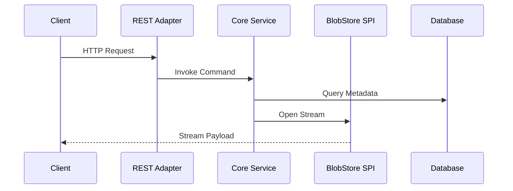
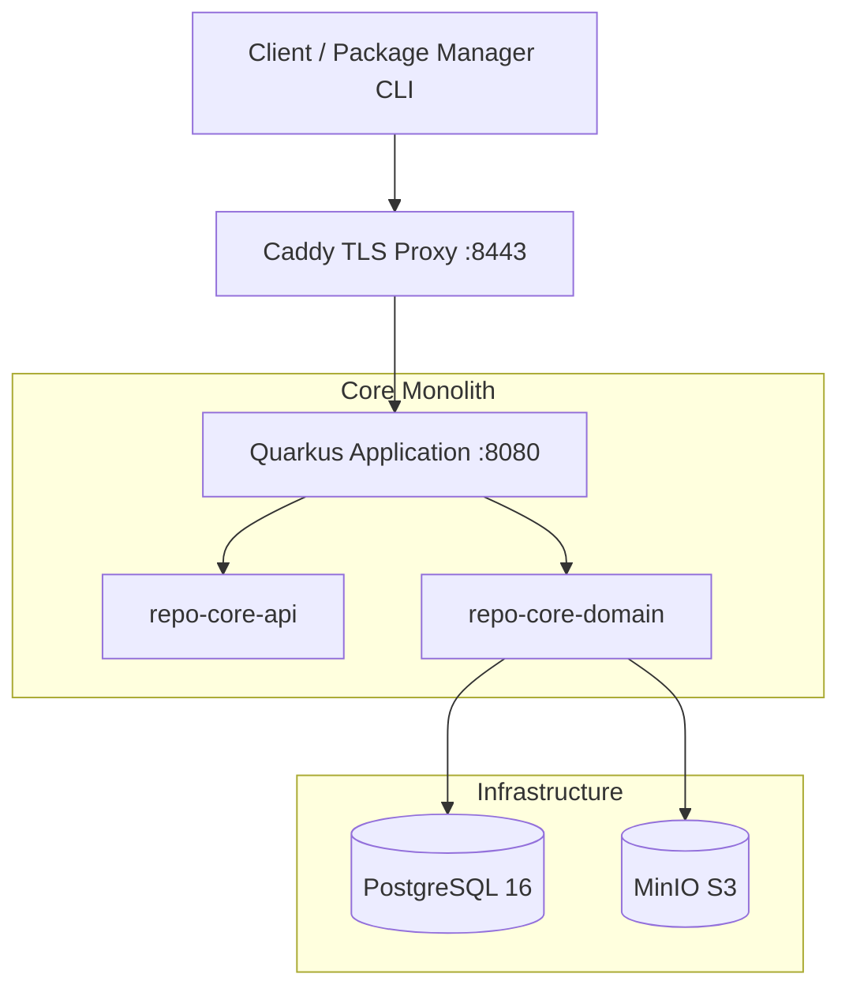

# Mermaid Diagram Templates

## Sequence Diagram Template

```mermaid
sequenceDiagram
    participant Client
    participant RestAdapter as REST Adapter
    participant CoreService as Core Service
    participant BlobStore as BlobStore SPI
    participant Database

    Client->>RestAdapter: HTTP Request
    RestAdapter->>CoreService: Invoke Command
    CoreService->>Database: Query Metadata
    CoreService->>BlobStore: Open Stream
    BlobStore-->>Client: Stream Payload
```

## System Topology Template

```mermaid
graph TD
    Client[Client / Package Manager CLI] --> Proxy[Caddy TLS Proxy :8443]
    Proxy --> Monolith[Quarkus Application :8080]

    subgraph Core Monolith
        Monolith --> API[repo-core-api]
        Monolith --> Domain[repo-core-domain]
    end

    subgraph Infrastructure
        Domain --> Postgres[(PostgreSQL 16)]
        Domain --> MinIO[(MinIO S3)]
    end
```
