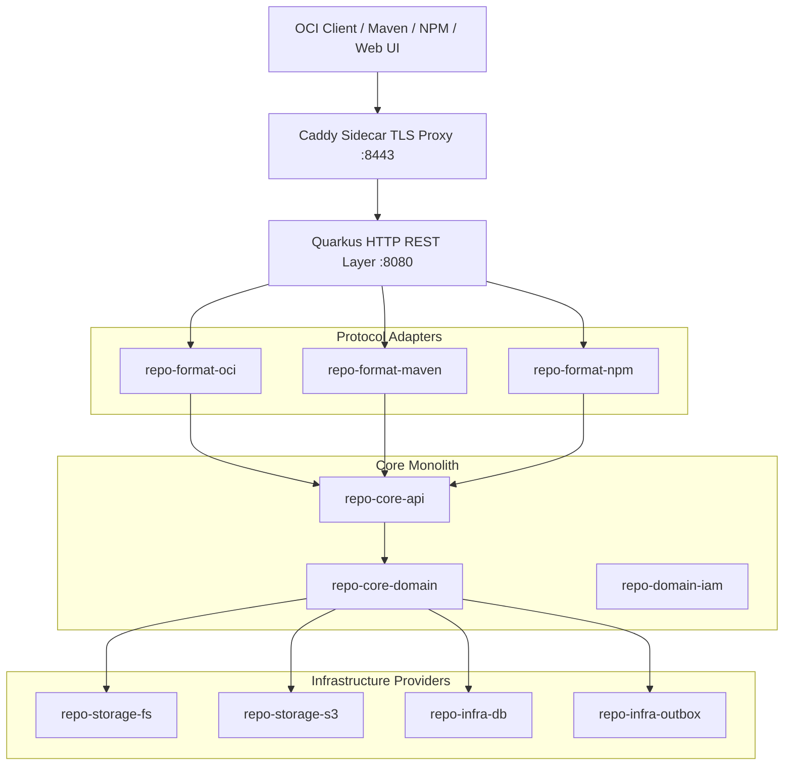

# OmniDepot Architecture Overview

OmniDepot is built as an **Evolutionary Modular Monolith** designed around **Hexagonal Architecture (Ports & Adapters)** and Domain-Driven Design (DDD) principles.

---

## 🏛️ System Architecture Diagram

---

## 🧩 Architectural Foundations

- **[Evolutionary Modular Monolith](evolutionary-monolith.md):** 15 decoupled Maven sub-modules enforcing compilation-level isolation.
- **[Data Model & Liquibase](data-model-liquibase.md):** PostgreSQL 16 JSONB & Embedded H2 CLOB dialect isolation with mandatory Liquibase `<rollback>` safety blocks.
- **[Security & IAM SPI](security-iam.md):** Abstract `TokenBroker` SPI supporting Bearer JWTs and basic authentication.
- **[Architectural Decision Records (ADRs)](adrs/index.md):** Complete catalog of ADRs governing system boundaries, storage, and deployment topologies.
