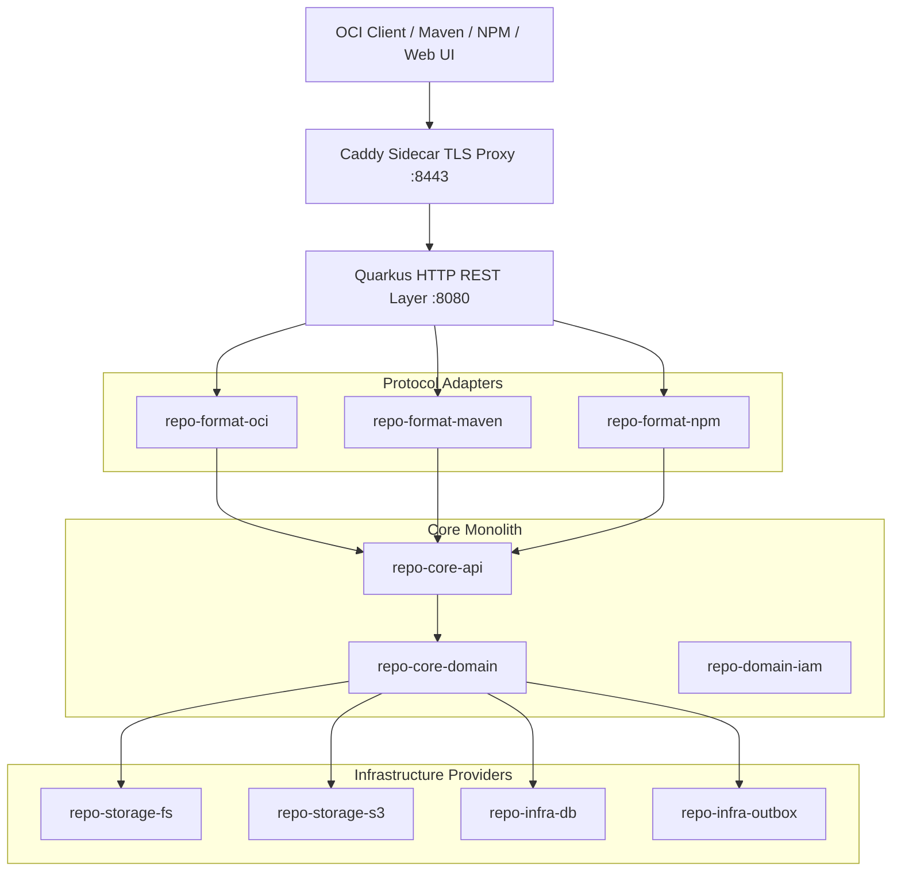

# OmniDepot Architecture Overview

OmniDepot is built as an **Evolutionary Modular Monolith** designed around **Hexagonal Architecture (Ports & Adapters)** and Domain-Driven Design (DDD) principles.

---

## 🏛️ System Architecture Diagram

---

## 🧩 Architectural Foundations & Deep-Dives

- **[AI Harness & Agent System Specification](ai-harness-agent-spec.md):** `.agents/` SSOT configuration, rules, agent execution protocols, and custom skills (`/add-format`, `/new-migration`, `/check-boundaries`, `/gen-benchmark`, `/gen-persona-tests`).
- **[Stakeholder Matrix & Persona Context](stakeholders-personas.md):** 7 persona profiles, Mendelow Power-Interest matrix, and persona-to-ADR traceability.
- **[Evolutionary Modular Monolith](evolutionary-monolith.md):** 15 decoupled Maven sub-modules enforcing compilation-level isolation.
- **[Content-Addressable Storage (CAS)](storage-cas.md):** Global SHA-256 deduplication, off-heap Netty streaming, and S3 5MB part aggregation.
- **[Data Model & Liquibase](data-model-liquibase.md):** PostgreSQL 16 JSONB & Embedded H2 CLOB dialect isolation with mandatory Liquibase `<rollback>` safety blocks.
- **[Transactional Outbox & Eventing](outbox-eventing.md):** Atomic event dispatches using `FOR UPDATE SKIP LOCKED` and Vert.x EventBus / Kafka.
- **[Protocol Adapters & Wire Translators](protocol-adapters.md):** OCI V2 Distribution, Maven layout checksum synthesis, and NPM Registry wire adapters.
- **[Virtual Repositories & Routing](virtual-routing.md):** Precedence-based route evaluation, pattern filters, and proxy revalidation TTLs.
- **[Security & IAM SPI](security-iam.md):** Abstract `TokenBroker` SPI supporting Bearer JWTs and basic authentication.
- **[Deployment Topologies](deployment-topologies.md):** 3-tier matrix topologies, decoupled health probes, and Caddy TLS proxy.
- **[Automated Testing & Quality Concept](testing-concept.md):** Binding test guidelines, test pyramid (*Test/*CT/*IT), ArchUnit protection rules, and 80%+ JaCoCo branch coverage.
- **[Architectural Decision Records (ADRs)](adrs/index.md):** Complete catalog of 31 ADRs governing system boundaries, storage, and deployment topologies.
