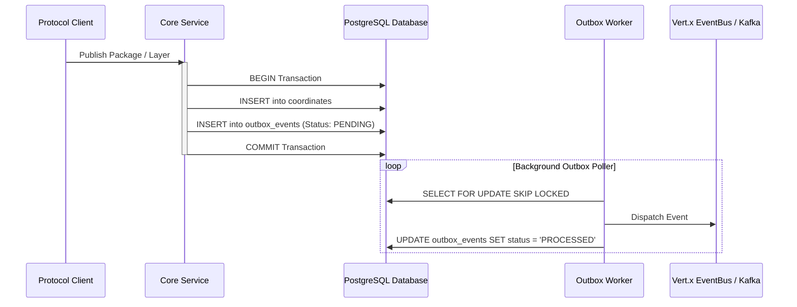

# Transactional Outbox Engine & Event-Driven Architecture

OmniDepot guarantees atomic event publishing and data consistency using the **Transactional Outbox Pattern** (ADR-016, ADR-026).

---

## 🔄 Transactional Outbox Flow

---

## Key Features

1. **At-Least-Once Delivery Guarantee:**
   - Events are persisted to `outbox_events` within the same database transaction as the domain entity update, ensuring zero lost events during container failures.

2. **Non-Blocking Multi-Node Polling (ADR-026):**
   - Polling workers query pending outbox records using `FOR UPDATE SKIP LOCKED`.
   - Prevents duplicate event dispatches and SQL deadlocks in multi-pod application clusters.

3. **Dual-Mode Event Routing:**
   - **Single Container Mode:** Local delivery via Vert.x EventBus.
   - **Clustered Enterprise Mode:** Distributed streaming via Apache Kafka topics.
