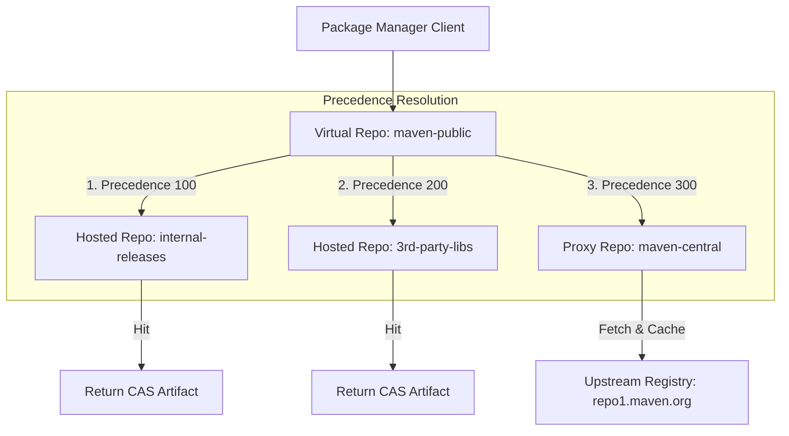

# Virtual Repositories & Precedence Routing

OmniDepot allows aggregating multiple hosted and proxy repositories into unified virtual endpoints (`VirtualRepository`) with prioritized resolution rules (ADR-024, ADR-027).

---

## 🔀 Virtual Precedence Evaluation Flow

---

## Key Features

1. **Precedence Ranking & Pattern Filters (ADR-024):**
   - Members are evaluated by integer `precedence` ranks (lowest integer = highest priority).
   - Optional `include_patterns` and `exclude_patterns` filter coordinates before query evaluation.

2. **Proxy Cache Revalidation TTL (ADR-027):**
   - Configurable Revalidation TTL (`repo.proxy.revalidation-ttl`, default `60s`) for mutable coordinates (`latest`, `*-SNAPSHOT`).
   - Expired TTL triggers conditional HTTP `HEAD` with `If-None-Match`. HTTP 304 refreshes TTL.
   - If upstream is unreachable, serves cached CAS artifact with `Warning: 110` fallback header.
