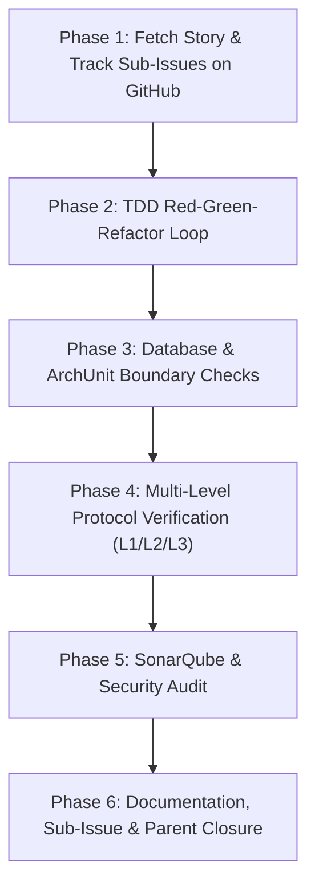

# Autonomous AI Story Execution Workflow (`/goal`)

> [!NOTE]
> **Master Operating Procedure for Autonomous Goal Execution**  
> This guide defines the standard operating procedure for fetching, decomposing into sub-issues, and executing story definitions and feature requests from GitHub in **omnidepot** using the autonomous AI harness with the `/goal` slash command.

---

## 1. Overview & Execution Philosophy

The development lifecycle in **omnidepot** is split into two distinct workflows:
1. **Workflow 1: [Story Creation & Refinement Workflow](file:///home/developer/projects/OmniDepot/docs/developer-guide/story-creation-workflow.md)** — Interactive authoring, lead architect auditing, test strategy breakdown, and GitHub issue publication.
2. **Workflow 2: Autonomous AI Story Execution Workflow (`/goal`)** — Autonomous execution of published GitHub issues using the `/goal` slash command.

When a published GitHub issue is assigned to the autonomous AI harness using `/goal` (e.g., `/goal Implement issue #4`), the agent operates autonomously through 6 structured phases to fetch the story from GitHub, decompose story tasks into tracked GitHub sub-issues, execute TDD development, verify boundaries, run tests, and close the sub-issues and parent issue.

---

## 2. Phase-by-Phase Workflow Specification

### Phase 1: Fetch Story & Track Sub-Issues on GitHub (`product-owner` + `lead-architect` + `tech-writer`)
1. **Fetch Issue from GitHub:** Retrieve the target issue specification directly from GitHub via the `github` MCP server tool `get_issue` (or GitHub REST API GET `https://api.github.com/repos/thoweber/omnidepot/issues/{number}`).
2. **Extract Specification & Requirements:** Parse the issue body for:
   - User Story & `[Name (Role)]` hyperlinked persona reference
   - Product Goal Contribution
   - Value Generation
   - Target Sub-modules (`omnidepot-*`)
   - REST Endpoints & Key Invariants
   - Protocol Verification Strategy (Level 1, Level 2, Level 3 where applicable)
   - Acceptance Criteria checklist
3. **Audit Context & Architectural Invariants (`lead-architect`):** Inspect referenced Architectural Decision Records (ADRs), enforce Hexagonal DDD boundaries, verify SOLID/CUPID principles, confirm strongly-typed Value Objects, and confirm JSpecify `@NullMarked` package annotation rules in `package-info.java`.
4. **Decompose & Create GitHub Sub-Issues:**  
   If the story contains multiple distinct implementation steps (e.g., domain SPI interfaces, Liquibase schema changes, REST endpoint mappers, Testcontainers integration), the agent **MUST** decompose the story into explicit **GitHub Sub-Issues**:
   * Each sub-issue MUST have a clear, descriptive title (`[SUB-TASK] <Sub-task Title>`).
   * Each sub-issue MUST contain a **meaningful description** detailing the exact task scope, target sub-module (`omnidepot-*`), technical deliverables, and acceptance criteria.
   * Link sub-issues to the parent GitHub story issue.
5. **Create & Checkout Feature Branch:**  
   Before executing TDD implementation in Phase 2, the agent **MUST** create and checkout a dedicated Git feature branch following the exact naming pattern:  
   `feature/STORY-XXX-short-description-not-too-long` (e.g., `feature/STORY-002-oci-manifest-ingestion`). All story commits MUST be executed on this feature branch.

---

### Phase 2: Test-Driven Development (TDD) Protocol (`tdd-runner` + `test-manager`)
1. **RED Phase:** Write unit tests (`*Test.java`) or component tests (`*CT.java`) using AssertJ assertions (`assertThat()`). Run `./mvnw test -Dtest=TargetTest` to confirm expected test failure.
2. **GREEN Phase:** Implement minimal production code in `package-private` classes inside the target sub-module. Run `./mvnw test -Dtest=TargetTest` until tests pass cleanly.
3. **REFACTOR Phase:** Run `./mvnw spotless:apply` to ensure code formatting compliance.

---

### Phase 3: Database & ArchUnit Boundary Verification (`liquibase-changelog` + `archunit-boundary-checker`)
1. **Liquibase Dual-Dialect Validation:** If database schema changes are required, author XML changelogs under `omnidepot-infra-db/src/main/resources/db/changelog/` and validate using the `validate_liquibase_changelog` tool across BOTH `postgresql` 16 and `h2`.
2. **ArchUnit Boundary Test:** Execute `./mvnw test -Dtest=ArchitectureBoundaryTest` to confirm zero Hexagonal layer boundary violations.

---

### Phase 4: Multi-Level Protocol Verification (`test-manager` + `devops-engineer`)
* **Level 1 (In-Memory Unit & Snapshot):** Fast in-memory unit tests and ApprovalTests snapshot checks ($< 10\text{ s}$).
* **Level 2 (API Contract & Schema Fuzzing):** OpenAPI contract compliance and error payload matrix checks (where applicable).
* **Level 3 (Black-Box E2E Native CLI via Testcontainers):** Un-mocked native client execution (`docker push/pull`, `mvn deploy`, `npm publish`) inside Testcontainers (where applicable).

---

### Phase 5: SonarQube & Quality Gate Audit (`sonar-remediation` + `security-analyst`)
1. **Quality Gate Verification:** Verify zero critical or major code smells, zero vulnerabilities, and $\ge 80\%$ branch coverage on new code.
2. **Security & Input Sanitization Audit:** Confirm input normalization before validation and off-heap JWT token handling.

---

### Phase 6: Documentation, Sub-Issue & Parent Closure (`tech-writer` + `product-owner`)
1. **Update Documentation:** Update `/docs/` using `tech-writer` rules (100% lowercase `omnidepot`, zero emojis, clickable `file://` scheme links, `[Name (Role)]` hyperlinked persona references).
2. **Close GitHub Sub-Issues:** As each sub-task is completed and verified, post a completion comment with test evidence and close the corresponding GitHub sub-issue.
3. **Close Parent GitHub Issue:** Post a comprehensive verification summary on the parent issue and close it on GitHub.
4. **Signal Goal Completion:** Include `<!-- GOAL_COMPLETE -->` in the final agent response.

---

## 3. Checklist for Autonomous Goal Execution

| Phase | Milestone Checklist Item | Mandatory Command / Tool |
| :--- | :--- | :--- |
| **Phase 1** | Fetch story issue & create GitHub sub-issues with meaningful descriptions | `get_issue` + `create_issue` |
| **Phase 2** | Execute TDD Red-Green-Refactor loop | `./mvnw test -Dtest=TargetTest` |
| **Phase 3** | Validate Liquibase changelog & ArchUnit boundaries | `validate_liquibase_changelog` + `./mvnw test -Dtest=ArchitectureBoundaryTest` |
| **Phase 4** | Run L1/L2/L3 protocol verification | `./mvnw clean verify` |
| **Phase 5** | Audit SonarCloud quality gate & security rules | `sonarcloud` MCP server audit |
| **Phase 6** | Update docs, close sub-issues and parent issue, complete | `create_issue` status update + `<!-- GOAL_COMPLETE -->` |
