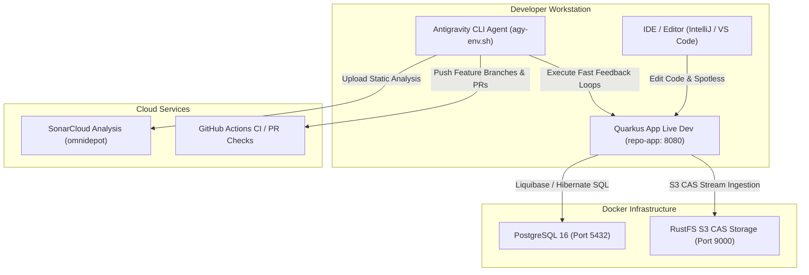

# omnidepot Developer Onboarding & Architecture Guide

Welcome to the developer onboarding guide for omnidepot. This document outlines the prerequisites, infrastructure container setup, database migration workflows, local feedback loops, Domain-Driven Design (DDD), Hexagonal Architecture invariants, and coding standards.

---

## 1. Local Development Topology

The following diagram illustrates the interaction between your local IDE/CLI, the Quarkus live development server, containerized infrastructure, and the autonomous AI harness agent:



---

## 2. Architecture: Domain-Driven Design (DDD) & Hexagonal Ports & Adapters

The omnidepot repository is built as an **Evolutionary Modular Monolith** structured strictly around **Hexagonal Architecture (Ports and Adapters)** and **Domain-Driven Design (DDD)** principles (`ADR-001`, `ADR-004`).

```mermaid
graph LR
    subgraph Driving Adapters (Protocol Inbound)
        OCI["repo-format-oci (/v2/)"]
        MAVEN["repo-format-maven (/maven/)"]
        NPM["repo-format-npm (/npm/)"]
    end

    subgraph Domain Core & SPI Ports
        API["repo-core-api (Public SPIs & Value Objects)"]
        CORE["repo-core-domain (Catalog & Virtual Routing)"]
        STORAGE_API["repo-storage-api (BlobStore SPI)"]
    end

    subgraph Driven Adapters (Infrastructure Outbound)
        FS["repo-storage-fs (Filesystem CAS)"]
        S3["repo-storage-s3 (AWS S3 / RustFS)"]
        DB["repo-infra-db (PostgreSQL / Liquibase)"]
        OUTBOX["repo-infra-outbox (Transactional Outbox)"]
    end

    OCI -->|Consumes SPI| API
    MAVEN -->|Consumes SPI| API
    NPM -->|Consumes SPI| API

    CORE -->|Implements Core Logic| API
    CORE -->|Uses CAS SPI| STORAGE_API

    FS -->|Implements BlobStore SPI| STORAGE_API
    S3 -->|Implements BlobStore SPI| STORAGE_API
    DB -->|Implements DB Outbox| OUTBOX
```

### Hexagonal Boundary Invariants
1. **Strict Public vs. Package-Private Encapsulation:**  
   Only interfaces, SPIs, tagging interfaces, and Value Objects residing in `repo-core-api` are `public`. Concrete adapter implementations (`FileSystemBlobStore`, `S3BlobStore`, `OciDistributionResource`) MUST remain `package-private` to enforce compilation-level layer isolation (`ADR-004`).
2. **Zero Circular Dependencies:**  
   Protocol adapters (`repo-format-oci`, `repo-format-maven`) depend strictly on `repo-core-api` and `repo-storage-api`. They MUST NEVER depend directly on concrete storage providers or DB infrastructure modules.
3. **ArchUnit Boundary Enforcement:**  
   Module visibility and layer boundaries are automatically verified by `./mvnw test -Dtest=ArchitectureBoundaryTest`.

---

## 3. Strongly-Typed Value Objects & Nullability Rules

The domain model avoids **Primitive Obsession** by encapsulating all domain identifiers and coordinates into strongly-typed Java 25 `record` Value Objects.

### A. Primitive Obsession Prevention
Instead of passing raw `String` or `long` primitives across layers, encapsulate them into dedicated Value Objects that implement tagging interfaces:

```java
// BAD: Primitive obsession
public BlobDescriptor getBlob(String rawDigest, String repoName, long bytes)

// GOOD: Strongly-typed Value Objects
public BlobDescriptor getBlob(Sha256Digest digest, OciRepositoryName repoName, BlobSize bytes)
```

**Core Value Objects:**
* **`Sha256Digest`**: Validated 64-character hexadecimal SHA-256 hash.
* **`OciRepositoryName`**: Normalized, validated OCI namespace (`repo-format-oci`).
* **`CasPath`**: Calculated Content-Addressable Storage path (`blobs/sha256/xx/yy/...`).
* **`BlobSize`**: Non-negative byte length with shared static `BlobSize.ZERO` singleton.
* **`UploadSessionId`**: Unique upload session identifier.

---

### B. Nullability Guardrails & Static Imports
* **Manual Null Checks:** Never use raw `== null` or `!= null`. Always use statically imported `isNull(val)` or `nonNull(val)`:
  ```java
  import static java.util.Objects.isNull;
  import static java.util.Objects.nonNull;

  if (isNull(rawName)) {
      throw new IllegalArgumentException("Name cannot be null");
  }
  ```
* **JSpecify `@NullMarked`:** All production packages feature `@NullMarked` in `package-info.java`. Parameters within `@NullMarked` packages are assumed non-null by default.
* **`Optional<T>` Return Types:** Use `Optional<T>` for any query or getter method return type that may not produce a result. Never return raw `null` from SPI methods.
* **Empty Collections:** Never return `null` for collection return types — always return an immutable empty collection (`List.of()`, `Set.of()`, `Map.of()`).

---

### C. Functional Optional Chains over Ternary Branching
Avoid ternary conditional branching (`a ? b : c`). Use functional `Optional` chains for parameter normalization, filtering, and default fallbacks:

```java
// BAD: Ternary conditional branching
String digest = rawDigest != null && !rawDigest.isBlank() ? rawDigest : "default";

// GOOD: Functional Optional chain
String digest = Optional.ofNullable(rawDigest)
        .filter(s -> !s.isBlank())
        .orElseThrow(() -> new OciDigestInvalidException("Missing required digest parameter"));
```

---

## 4. Prerequisites

Ensure the following tools are installed on your workstation prior to setting up the environment:

| Requirement | Supported Version | Purpose |
| :--- | :--- | :--- |
| **Java JDK** | **Java 25 LTS** (Temurin / OpenJDK) | Production runtime & reactor build (`ADR-001`) |
| **Maven** | 3.9+ (or `./mvnw` wrapper) | Multi-module reactor build engine |
| **Container Engine** | Docker 24+ or Podman 4+ | Infrastructure service containers (`docker compose`) |
| **Node.js & npm** | Node.js 20+ / npm 10+ | Front-end SPA (`@omni-depot/ui`) & MCP proxies |
| **Git** | 2.40+ | Version control & feature branch workflows |

---

## 5. Step-by-Step Developer Setup

### Step 1: Clone Repository & Create Local Secrets
Clone the repository and instantiate your local environment credentials file (`agy.env`):

```bash
git clone https://github.com/thoweber/omnidepot.git
cd omnidepot

# Copy example environment configuration to agy.env
cp agy.env.example agy.env
```

Open `agy.env` in your text editor and populate your credentials:
```bash
GITHUB_TOKEN=ghp_yourPersonalAccessToken
SONAR_TOKEN=your_sonarcloud_token
```

---

### Step 2: Start Infrastructure Containers
Bring up the ephemeral PostgreSQL 16 database and RustFS Content-Addressable Storage (CAS) S3 containers:

```bash
# Start PostgreSQL 16 and RustFS S3 containers in background
docker compose up -d postgres rustfs

# Verify PostgreSQL readiness
docker compose exec -T postgres pg_isready -U omnidepot -d omnidepot
```

---

### Step 3: Run Database Migrations
Execute Liquibase changelog updates and rollback validations against the local development database:

```bash
# Validate dual-dialect XML changelogs against DB
./mvnw compile liquibase:updateTestingRollback -pl repo-infra-db
```

---

### Step 4: Execute Local Verification Loops ($< 30\text{ s}$)
To iterate fast without waiting for remote CI/CD, run the sub-30-second local verification loops enforced by [AGENTS.md](file:///home/developer/projects/omnidepot/AGENTS.md):

```bash
# 1. Compile & Fast Unit Tests (< 10 s)
./mvnw test -Dtest=*Test

# 2. Component & ArchUnit Boundary Tests (< 30 s)
./mvnw test -Dtest=*CT,ArchitectureBoundaryTest

# 3. Apply Code Auto-Formatting & Full Reactor Build (< 60 s)
./mvnw spotless:apply && ./mvnw clean verify
```

---

### Step 5: Start Quarkus Live Development Mode
Launch the application in Quarkus Live Coding mode (`repo-app`). Code changes recompile automatically on hot-reload:

```bash
# Start Quarkus Live Dev server
./mvnw quarkus:dev -pl repo-app
```

* **Application HTTP Port:** `http://localhost:8080`
* **Quarkus Dev UI:** `http://localhost:8080/q/dev/`
* **Health Endpoint:** `http://localhost:8080/q/health`
* **Management Port:** `http://localhost:9000`

---

### Step 6: Launch Antigravity AI Agent Harness
To run the autonomous AI pair programmer equipped with all local credentials:

```bash
# Launch agy with agy.env variables automatically loaded
./agy-env.sh
```

---

## 6. Key Repository Guidelines & Coding Standards

* **Strongly-Typed Domain Exceptions:** Never throw raw `RuntimeException` or `Exception` in production code. Throw domain-appropriate exceptions (`StorageException`, `BlobWriteException`, `OciProtocolException`).
* **1-to-1 Target-Class Test Mapping:** Every production class must have a dedicated 1-to-1 unit test class (`<ClassName>Test.java`).
* **Liquibase Migration Rollbacks:** Every database changeSet must define an explicit `<rollback>` block.

---

## 7. Recommended Slash Commands & MCP Workflows for Refactoring

When conducting extensive refactorings, multi-module domain model updates, or cross-cutting API changes across omnidepot's 15 Maven reactor modules, pair programming with the AI harness is significantly enhanced by leveraging **Slash Commands** alongside the **`intellij` MCP Server**.

### Recommended Slash Commands

| Slash Command | Purpose & Best Practice in Refactoring Workflows |
| :--- | :--- |
| **`/plan`** | **Plan & Blueprint First:** Use `/plan` to generate a structured, step-by-step refactoring blueprint before mutating shared SPI interfaces in `repo-core-api`. |
| **`/grill-me`** | **Interactive Design Alignment:** Trigger `/grill-me` to resolve architectural trade-offs, package encapsulation choices, or Hexagonal boundary decisions prior to writing code. |
| **`/goal`** | **Autonomous Refactoring Goal:** Use `/goal` for large-scale, long-running refactorings, directing the agent to iterate through unit tests, ArchUnit checks, and Sonar audits until the goal is fully achieved. |
| **`/learn`** | **Persist Learned Context:** Use `/learn` when a complex refactoring pattern or workspace configuration fix is discovered so future agent sessions adopt the behavior. |

### Leveraging the `intellij` MCP Server

The **`intellij` MCP server** (configured via direct SSE at `http://127.0.0.1:64343/sse` or `idea stdioMcpServer`) is strongly recommended during refactorings:

1. **AST-Aware Renaming (`rename_refactoring`)**: Automatically updates class, method, and variable usages across all 15 reactor modules without broken cross-module imports.
2. **Call Hierarchy Analysis (`analyze_calls` & `search_symbol`)**: Safely traces upstream callers and downstream implementation dependencies before modifying core interfaces.
3. **Real-time IDE Diagnostics (`get_file_problems` & `lint_files`)**: Instantly catches compilation errors and `@NullMarked` contract violations without waiting for full Maven reactor build cycles.
4. **Automated Formatting (`reformat_file`)**: Enforces code style rules on all modified files.

---

## 8. AI Development Workflows & Governance

For step-by-step guidance on authoring stories and executing autonomous goal tasks, see the dedicated workflow guides:
* **Workflow 1:** [Story Creation & Refinement Workflow Guide](file:///home/developer/projects/omnidepot/docs/developer-guide/story-creation-workflow.md) — Authoring, lead architect auditing, persona linking, test strategy breakdown, and GitHub issue creation.
* **Workflow 2:** [Autonomous AI Story Execution Workflow Guide](file:///home/developer/projects/omnidepot/docs/developer-guide/ai-story-workflow.md) — Autonomous execution of published GitHub issues using the `/goal` slash command.
