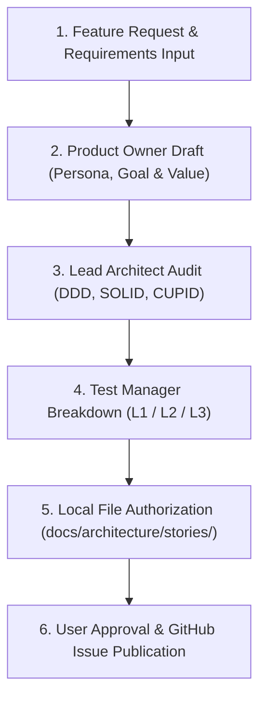

# Story Creation & Refinement Workflow Guide

> [!NOTE]
> **Master Operating Procedure for Story Authoring & GitHub Issue Preparation**  
> This guide defines the standard operating procedure for creating, refining, architecturally auditing, and publishing feature story definitions as GitHub issues in **omnidepot**.

---

## 1. Overview & Role Responsibilities

The Story Creation & Refinement Workflow is an interactive, multi-role process that transforms high-level requirements into fully audited, spec-compliant GitHub issues and documentation files before implementation begins.

---

## 2. Phase-by-Phase Workflow Specification

### Step 1: Draft User Story & Value Proposition (`product-owner`)
1. **Persona Reference:** Select the relevant stakeholder persona from [docs/architecture/stakeholders-personas.md](file:///home/developer/projects/OmniDepot/docs/architecture/stakeholders-personas.md) and format on first mention as **`[Name (Role)]`** hyperlinked directly to their profile (e.g. `[Mateo Rossi (Senior Full-Stack Developer)](file:///home/developer/projects/OmniDepot/docs/architecture/stakeholders-personas.md#persona-1-mateo-rossi--senior-full-stack-developer)`).
2. **Product Goal Contribution:** Explicitly detail how the story advances omnidepot's master product goals (polyglot OCI/Maven/NPM repository, Evolutionary Modular Monolith on Java 25 LTS, zero vendor lock-in, 70%+ CAS deduplication).
3. **Value Generation:** Detail explicitly the quantitative or qualitative business, operational, and developer velocity value delivered by the story.

---

### Step 2: Architectural Audit & Boundary Check (`lead-architect`)
1. **Hexagonal Sub-module Scope:** Identify exact reactor sub-modules involved (`omnidepot-format-*`, `omnidepot-core-domain`, `omnidepot-core-api`, `omnidepot-storage-api`).
2. **Encapsulation & SPI Rules:** Guarantee that concrete classes remain `package-private` and public surface area is strictly restricted to `omnidepot-core-api`.
3. **SOLID & CUPID Principles:** Enforce Single Responsibility (SRP), Open/Closed SPI extension (OCP), strongly-typed Value Objects (`Sha256Digest`, `CasPath`), JSpecify `@NullMarked` package rules, and zero raw exception handling.

---

### Step 3: Protocol Verification Strategy Breakdown (`test-manager`)
Define explicit verification levels **where applicable**:
* **Level 1 (In-Memory Unit & Snapshot):** Unit tests (`*Test.java`), deserialization checks, canonical digest calculations, and in-memory database entity snapshot tests.
* **Level 2 (API Contract & Schema Fuzzing):** OpenAPI REST contract compliance (`*CT.java`), HTTP status code matrix, and header fuzzing (where applicable).
* **Level 3 (Black-Box E2E Native CLI via Testcontainers):** Un-mocked native client execution (`docker push/pull`, `mvn deploy`, `npm publish`) inside Testcontainers (`*IT.java`) (where applicable).

---

### Step 4: Author Local Story Specification File (`tech-writer`)
Author the canonical markdown specification file under `docs/architecture/stories/STORY-XXX-<short-name>.md` following global writing rules:
- 100% lowercase `omnidepot` product branding
- Zero emojis
- Active voice and clickable `file://` scheme links

---

### Step 5: User Review & Approval
Present the completed story specification to the user and request approval before publishing to GitHub.

---

### Step 6: Create GitHub Issue (`product-owner`)
Upon user approval, create the GitHub Issue on `thoweber/omnidepot` via the `create_issue` tool or GitHub REST API `POST https://api.github.com/repos/thoweber/omnidepot/issues`:
* **Title:** `[STORY-XXX] <Story Title>`
* **Body:** Full GFM story body containing User Story, Persona Link, Product Goal Contribution, Value Generation, Scope & Sub-modules, REST Endpoints, Test Strategy, and Acceptance Criteria checklist.

---

### Step 7: Draft Markdown File Cleanup (`tech-writer`)
Immediately after the issue is created on GitHub, **delete** the local draft markdown file under `docs/architecture/stories/` so that GitHub issues serve as the single source of truth for story tracking.
