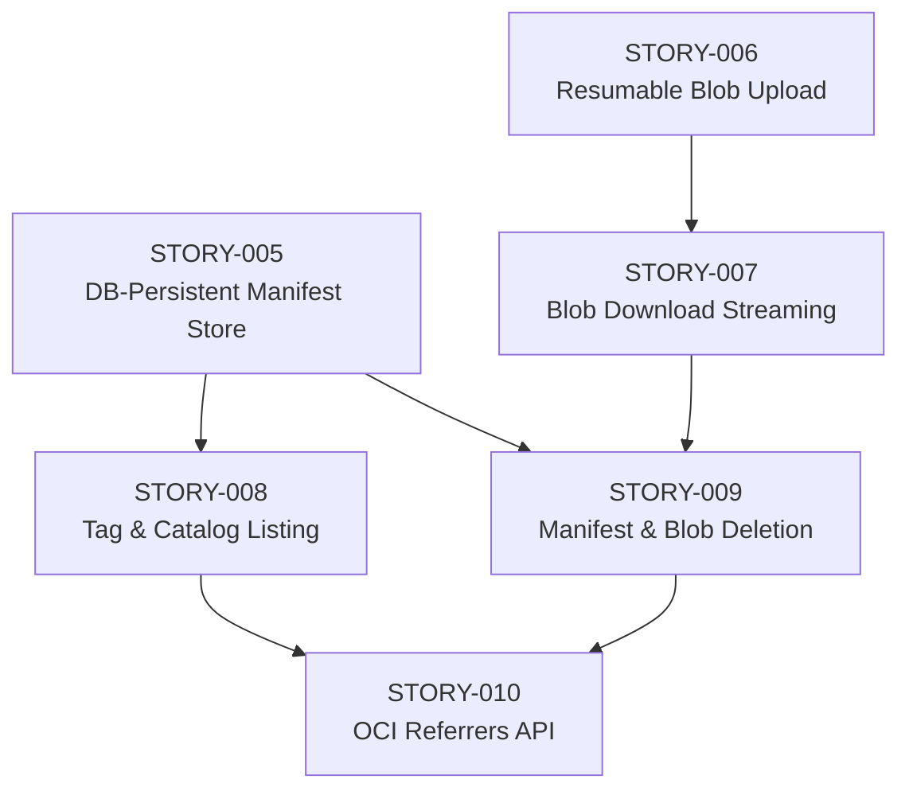
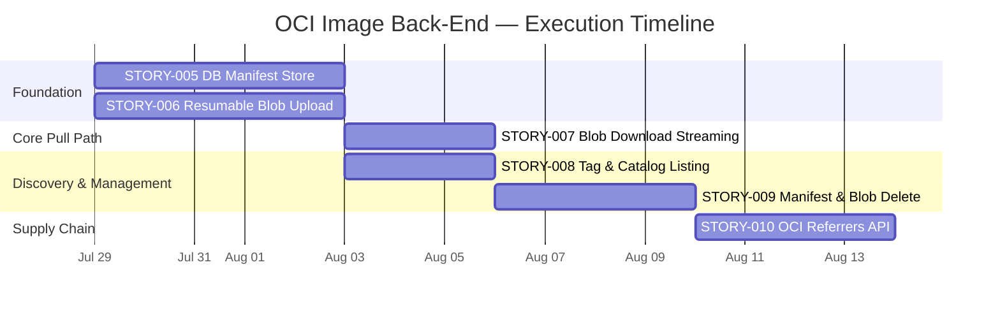

# OCI Image Back-End — Vertical Implementation Plan

> [!NOTE]
> **Baseline:** [STORY-002 (Issue #4)](https://github.com/thoweber/omnidepot/issues/4) is **closed**. It delivered OCI manifest ingestion (PUT/GET/HEAD), basic blob upload initiation (POST/PUT), cross-repo blob mount, CAS existence guard, and in-memory `ConcurrentHashMap` manifest storage inside [OciDistributionResource.java](file:///home/developer/projects/OmniDepot/omnidepot-format-oci/src/main/java/io/omnidepot/format/oci/OciDistributionResource.java).

---

## Current State Analysis

### Implemented (STORY-002)

| Endpoint | Method | Status |
| :--- | :--- | :--- |
| `/v2/` | GET | Version check |
| `/v2/{name}/blobs/uploads` | POST | Upload initiation + cross-repo mount |
| `/v2/{name}/blobs/uploads/{sessionId}` | PUT | Monolithic upload finalization |
| `/v2/{name}/blobs/{digest}` | HEAD | Blob existence check (stub — always returns 200) |
| `/v2/{name}/manifests/{reference}` | PUT | Manifest ingestion with CAS guard |
| `/v2/{name}/manifests/{reference}` | GET | Manifest retrieval |
| `/v2/{name}/manifests/{reference}` | HEAD | Manifest existence |

### Architectural Gaps

| Gap | Impact | Priority |
| :--- | :--- | :--- |
| Manifests stored in `ConcurrentHashMap` — no DB persistence | Data loss on restart; no query capabilities | **Critical** |
| Upload sessions not tracked in DB (`UploadSessionRepository` SPI exists but has no implementation) | No resumable upload support; stateless finalization | **Critical** |
| No blob GET (download) streaming from CAS | `docker pull` cannot retrieve layer content | **Critical** |
| No chunked PATCH upload endpoint | Large image layers fail; breaks OCI spec compliance | **High** |
| HEAD blob returns stub 200 (no actual CAS existence check with real size) | Misleading existence checks | **High** |
| No tag listing endpoint (`GET /v2/{name}/tags/list`) | Docker CLI cannot list available tags | **Medium** |
| No catalog listing endpoint (`GET /v2/_catalog`) | Registry browsing and discovery unavailable | **Medium** |
| No manifest/blob DELETE | Cannot delete images; blocks GC workflows | **Medium** |
| No OCI 1.1 Referrers API (`GET /v2/{name}/referrers/{digest}`) | No signature or SBOM attachment discovery | **Low** |

---

## Story Dependency Graph



---

## STORY-005 — DB-Persistent OCI Manifest & Repository Catalog Store ([#36](https://github.com/thoweber/omnidepot/issues/36))

### Context & Architecture Reference
> [!NOTE]
> ADR-004 (Hybrid Port-Path Routing), ADR-015 (Pure CAS), ADR-023 (Liquibase Dynamic Migration). Primary modules: `omnidepot-format-oci`, `omnidepot-core-domain`, `omnidepot-core-api`, `omnidepot-infra-db`.

### User Story
As [Mateo Rossi (Senior Full-Stack Developer)](https://github.com/thoweber/omnidepot/blob/main/docs/architecture/stakeholders-personas.md#persona-1-mateo-rossi--senior-full-stack-developer), I want omnidepot to persist OCI manifests and repository metadata in a relational database (H2 for dev/test, PostgreSQL for production), so that pushed container images survive application restarts, support indexed queries, and enable tag listing and catalog browsing.

### Product Goal Contribution
- **Polyglot Registry Durability:** Transforms the OCI adapter from a volatile prototype into a production-grade registry back-end with durable, queryable metadata storage.

### Value Generation
- **Developer Value:** Images pushed via `docker push` are retained across restarts; `docker pull` is reliable after redeployments.
- **Operational Value:** Enables SRE teams to audit repository contents, monitor manifest counts, and build cleanup policies against structured DB records.

### Scope & Sub-modules
- `omnidepot-core-api` — New `ManifestStore` SPI interface, `ManifestRecord` value object
- `omnidepot-core-domain` — `ManifestStore` implementation using Hibernate Reactive / Panache
- `omnidepot-infra-db` — Liquibase changelog `v1.1.0-oci-manifests.xml` (dual-dialect H2/PostgreSQL)
- `omnidepot-format-oci` — Migrate `OciDistributionResource` from `ConcurrentHashMap` to injected `ManifestStore`

### REST Endpoints & Key Invariants
- `PUT /v2/{name}/manifests/{reference}` — Now persists to DB instead of in-memory map
- `GET /v2/{name}/manifests/{reference}` — Now reads from DB
- `HEAD /v2/{name}/manifests/{reference}` — Now checks DB existence
- **Invariant:** Manifest JSON payload stored as-is alongside computed `sha256` digest; tag references and digest references both resolve to the same underlying record.
- **Invariant:** Dual-dialect Liquibase changelog with `dbms="postgresql"` for `jsonb` and `dbms="h2"` for `CLOB`.

### DB Schema (New Tables)

> [!NOTE]
> Manifest payloads are stored **inline** in the `oci_manifests` table (not in a separate `oci_manifest_payloads` table). This keeps each format adapter's schema self-contained, which scales cleanly when adding Maven, NPM, PyPI, and DEB formats — each with their own format-specific tables. High-frequency metadata-only queries (tag listing, catalog) use the `oci_tags` table and never load payloads.

```sql
-- oci_manifests: stores manifest metadata and raw JSON payload (inline)
CREATE TABLE oci_manifests (
    id              VARCHAR(36)   PRIMARY KEY,
    repository_id   VARCHAR(36)   NOT NULL REFERENCES repositories(id),
    digest          VARCHAR(71)   NOT NULL,  -- 'sha256:' + 64 hex chars
    media_type      VARCHAR(255)  NOT NULL,
    size_bytes      BIGINT        NOT NULL,
    payload         TEXT/CLOB     NOT NULL,  -- raw manifest JSON (inline for schema isolation)
    created_at      TIMESTAMP     NOT NULL,
    UNIQUE (repository_id, digest)
);

-- oci_tags: maps tag names to manifest digests within a repository
CREATE TABLE oci_tags (
    id              VARCHAR(36)   PRIMARY KEY,
    repository_id   VARCHAR(36)   NOT NULL REFERENCES repositories(id),
    tag_name        VARCHAR(128)  NOT NULL,
    manifest_id     VARCHAR(36)   NOT NULL REFERENCES oci_manifests(id),
    updated_at      TIMESTAMP     NOT NULL,
    UNIQUE (repository_id, tag_name)
);
```

### test-manager Protocol Verification Strategy
- **Level 1 (In-Memory Unit & Snapshot):**
  - `ManifestStoreTest.java`: Verify CRUD operations, digest-based lookup, tag upsert, duplicate digest handling.
- **Level 2 (API Contract & Schema Fuzzing):**
  - `OciManifestPersistenceCT.java`: Full PUT/GET/HEAD cycle against embedded H2, verifying data survives across requests.
- **Level 3 (Black-Box E2E via Testcontainers):**
  - Extend `OciNativeDockerIT.java`: Push image, restart application context, verify `docker pull` still works.

### Acceptance Criteria
- [ ] New `ManifestStore` SPI interface in `omnidepot-core-api`.
- [ ] Hibernate Reactive / Panache implementation in `omnidepot-core-domain`.
- [ ] Liquibase dual-dialect changelog (`v1.1.0-oci-manifests.xml`) with `oci_manifests`, `oci_tags` tables.
- [ ] `OciDistributionResource` refactored to use injected `ManifestStore` instead of `ConcurrentHashMap`.
- [ ] Auto-create `repositories` row on first manifest push for a new OCI namespace.
- [ ] Tag PUT upserts (re-tagging points tag to new digest).
- [ ] Liquibase validator passes for both H2 and PostgreSQL dialects.
- [ ] JSpecify `@NullMarked` on all package boundaries.
- [ ] Sub-30-second local test suite execution.

---

## STORY-006 — Resumable Chunked Blob Upload (PATCH + Session Tracking) ([#37](https://github.com/thoweber/omnidepot/issues/37))

### Context & Architecture Reference
> [!NOTE]
> ADR-020 (Persistent Upload Session SPI), ADR-015 (Pure CAS), ADR-025 (S3 5MB Part Aggregation). Primary modules: `omnidepot-format-oci`, `omnidepot-core-api`, `omnidepot-core-domain`, `omnidepot-infra-db`.

### User Story
As [Mateo Rossi (Senior Full-Stack Developer)](https://github.com/thoweber/omnidepot/blob/main/docs/architecture/stakeholders-personas.md#persona-1-mateo-rossi--senior-full-stack-developer), I want omnidepot to accept resumable chunked blob uploads via the OCI PATCH endpoint with persistent upload session tracking, so that large container image layers (multi-GB) can be uploaded reliably over unstable networks and resumed after interruption.

### Product Goal Contribution
- **OCI Spec Compliance:** PATCH-based chunked upload is mandatory for real Docker/Podman client compatibility with layers > 1 MB.
- **Storage Efficiency:** Streaming chunks directly to CAS via `BlobStore.put()` without buffering entire layers in memory.

### Value Generation
- **Developer Value:** `docker push` of production-sized images (500 MB+) completes reliably with automatic retry support.
- **Operational Value:** Upload sessions tracked in DB enable monitoring, cleanup of stale uploads, and upload resumption after pod restarts.

### Scope & Sub-modules
- `omnidepot-core-domain` — `UploadSessionRepository` implementation backed by `upload_sessions` table
- `omnidepot-format-oci` — New `PATCH /v2/{name}/blobs/uploads/{sessionId}` endpoint; refactor `PUT` finalization to validate against session state; new `GET /v2/{name}/blobs/uploads/{sessionId}` for status; new `DELETE /v2/{name}/blobs/uploads/{sessionId}` for cancellation
- `omnidepot-infra-db` — Extend `upload_sessions` table with `sha256_partial_state` column: `BYTEA` (PostgreSQL) / `BLOB` (H2) for storing serialized `MessageDigest` state between PATCH chunks (~100-200 bytes binary, no Base64 encoding overhead)

### REST Endpoints & Key Invariants
- `POST /v2/{name}/blobs/uploads` — Creates persistent DB session (replaces stateless generation)
- `GET /v2/{name}/blobs/uploads/{sessionId}` — Returns upload progress via `Range` header (204 No Content)
- `PATCH /v2/{name}/blobs/uploads/{sessionId}` — Accepts chunk with `Content-Type: application/octet-stream`, updates `bytes_received`, streams to temp CAS
- `PUT /v2/{name}/blobs/uploads/{sessionId}?digest=sha256:...` — Finalizes upload, verifies digest, commits blob to CAS, writes `blobs` DB record
- `DELETE /v2/{name}/blobs/uploads/{sessionId}` — Cancels upload, deletes session and temp data
- **Invariant:** `Content-Range` header tracks byte offsets; server returns `Range: 0-<last_byte>` on each response.
- **Invariant:** Final PUT validates that the accumulated SHA-256 digest matches the `?digest=` parameter.
- **Invariant:** Blob record written to `blobs` table on successful finalization (linking CAS path to DB metadata).

### test-manager Protocol Verification Strategy
- **Level 1 (In-Memory Unit & Snapshot):**
  - `UploadSessionRepositoryTest.java`: CRUD lifecycle, progress updates, status transitions.
  - `ChunkedDigestAccumulatorTest.java`: Incremental SHA-256 across multiple byte chunks.
- **Level 2 (API Contract & Schema Fuzzing):**
  - `OciChunkedUploadCT.java`: Multi-PATCH sequence, Content-Range validation, out-of-order chunk rejection, duplicate session detection.
- **Level 3 (Black-Box E2E via Testcontainers):**
  - `OciBlobUploadIT.java` extension: Push a multi-layer image with Docker client, verify all layers stored in CAS.

### Acceptance Criteria
- [ ] `PATCH /v2/{name}/blobs/uploads/{sessionId}` endpoint accepting `application/octet-stream` chunks.
- [ ] `GET /v2/{name}/blobs/uploads/{sessionId}` returns 204 with `Range` header.
- [ ] `DELETE /v2/{name}/blobs/uploads/{sessionId}` cancels and cleans up session.
- [ ] Upload sessions persisted in `upload_sessions` DB table via `UploadSessionRepository`.
- [ ] Incremental SHA-256 digest computation across PATCH chunks.
- [ ] Final PUT validates accumulated digest against `?digest=` parameter; returns `DIGEST_INVALID` on mismatch.
- [ ] `Content-Range` and `Range` headers spec-compliant on all responses.
- [ ] Blob record written to `blobs` table on successful finalization.
- [ ] JSpecify `@NullMarked` on all package boundaries.
- [ ] Sub-30-second local test suite execution.

---

## STORY-007 — Blob Download Streaming (GET /v2/{name}/blobs/{digest}) ([#38](https://github.com/thoweber/omnidepot/issues/38))

### Context & Architecture Reference
> [!NOTE]
> ADR-003 (Hexagonal Storage SPI), ADR-006 (Zero-GC Off-Heap Memory), ADR-015 (Pure CAS). Primary modules: `omnidepot-format-oci`, `omnidepot-core-api`.

### User Story
As [Mateo Rossi (Senior Full-Stack Developer)](https://github.com/thoweber/omnidepot/blob/main/docs/architecture/stakeholders-personas.md#persona-1-mateo-rossi--senior-full-stack-developer), I want omnidepot to stream blob content from Content-Addressable Storage when a client requests `GET /v2/{name}/blobs/{digest}`, so that `docker pull` can download image layers and config blobs.

### Product Goal Contribution
- **Complete Pull Workflow:** Without blob GET, `docker pull` fails at layer download — this is the critical missing piece for a functional OCI registry.
- **Sub-Millisecond Hot-Path Streaming:** Non-blocking streaming from CAS via Vert.x reactive pipeline avoids heap buffering per ADR-006.

### Value Generation
- **Developer Value:** End-to-end `docker push` + `docker pull` cycle becomes fully functional.
- **Operational Value:** Streaming from CAS via `BlobStore.openStream()` avoids buffering entire blobs in JVM heap, supporting multi-GB layers without OOM risk.

### Scope & Sub-modules
- `omnidepot-format-oci` — New `GET /v2/{name}/blobs/{digest}` endpoint; enhance existing `HEAD` to return real `Content-Length` from CAS descriptor and 404 when blob is missing
- `omnidepot-core-api` — Utilize existing `BlobStore.openStream()` and `BlobStore.getDescriptor()`

### REST Endpoints & Key Invariants
- `GET /v2/{name}/blobs/{digest}` — Streams blob bytes with `Content-Type: application/octet-stream`, `Content-Length`, and `Docker-Content-Digest` headers
- `HEAD /v2/{name}/blobs/{digest}` — Enhanced: returns real `Content-Length` from `BlobDescriptor.sizeBytes()` and 404 if missing
- **Invariant:** Returns HTTP 404 with OCI error JSON (`BLOB_UNKNOWN`) if digest not found in CAS.
- **Invariant:** Non-blocking streaming via Vert.x `StreamingOutput` or Mutiny reactive pipeline — never buffer full blob in memory.

### test-manager Protocol Verification Strategy
- **Level 1 (In-Memory Unit & Snapshot):**
  - `BlobStreamingTest.java`: Verify correct `Content-Length`, `Docker-Content-Digest` headers; 404 for missing blobs.
- **Level 2 (API Contract & Schema Fuzzing):**
  - `OciBlobDownloadCT.java`: Upload blob via PUT, download via GET, compare SHA-256; HEAD returns correct size.
- **Level 3 (Black-Box E2E via Testcontainers):**
  - Extend `OciNativeDockerIT.java`: Full `docker push` + `docker pull` cycle — verify pulled image digest matches pushed image.

### Acceptance Criteria
- [ ] `GET /v2/{name}/blobs/{digest}` streams blob content from `BlobStore`.
- [ ] `HEAD /v2/{name}/blobs/{digest}` returns real `Content-Length` and 404 for missing blobs.
- [ ] `Docker-Content-Digest` header present on both GET and HEAD responses.
- [ ] HTTP 404 with `BLOB_UNKNOWN` OCI error JSON for non-existent digests.
- [ ] Non-blocking streaming (no full-blob heap buffering).
- [ ] JSpecify `@NullMarked` on all package boundaries.
- [ ] Sub-30-second local test suite execution.

---

## STORY-008 — OCI Tag Listing & Catalog Discovery ([#39](https://github.com/thoweber/omnidepot/issues/39))

### Context & Architecture Reference
> [!NOTE]
> ADR-004 (Hybrid Port-Path Routing). Primary modules: `omnidepot-format-oci`, `omnidepot-core-domain`, `omnidepot-core-api`.

### User Story
As [Sven Lindqvist (Senior SRE & Platform Lead)](https://github.com/thoweber/omnidepot/blob/main/docs/architecture/stakeholders-personas.md#persona-2-sven-lindqvist--senior-sre--platform-lead), I want omnidepot to expose the OCI tag listing and catalog endpoints, so that platform operators can discover available repositories and image tags for monitoring dashboards, cleanup automation, and Kubernetes admission controllers.

### Product Goal Contribution
- **OCI Spec Completeness:** Tag listing and catalog are required OCI Distribution Spec endpoints for registry discovery and tooling compatibility (Skopeo, Crane, Harbor replication).

### Value Generation
- **Operational Value:** SRE teams can script automated tag-based retention policies and build real-time registry dashboards.
- **Developer Value:** `docker image ls` and registry UI browsing work out of the box.

### Scope & Sub-modules
- `omnidepot-format-oci` — New `GET /v2/{name}/tags/list` and `GET /v2/_catalog` endpoints
- `omnidepot-core-api` — Query methods on `ManifestStore` SPI (from STORY-005): `listTags(repositoryName, n, last)`, `listRepositories(n, last)`
- `omnidepot-core-domain` — Paginated DB queries with `n` (limit) and `last` (cursor) parameters

### REST Endpoints & Key Invariants
- `GET /v2/{name}/tags/list` — Returns `{"name": "...", "tags": ["1.0.0", "latest", ...]}` with pagination via `?n=100&last=latest`
- `GET /v2/_catalog` — Returns `{"repositories": ["library/ubuntu", "my-org/alpine", ...]}` with pagination
- **Invariant:** Tags sorted lexicographically; pagination follows OCI Distribution Spec `Link` header convention (RFC 5988).
- **Invariant:** Empty tag list returns `{"name": "...", "tags": []}`, not 404.

### test-manager Protocol Verification Strategy
- **Level 1 (In-Memory Unit & Snapshot):**
  - `TagListingTest.java`: Verify JSON response shape, pagination cursor logic, empty results.
- **Level 2 (API Contract & Schema Fuzzing):**
  - `OciTagListingCT.java`: Push multiple tags, verify listing; test pagination with `n` and `last` parameters.
- **Level 3 (Black-Box E2E via Testcontainers):**
  - `OciCatalogIT.java`: Push images to multiple repos, verify `_catalog` and `tags/list` via `curl` or `skopeo list-tags`.

### Acceptance Criteria
- [ ] `GET /v2/{name}/tags/list` returns spec-compliant JSON with lexicographic tag ordering.
- [ ] `GET /v2/_catalog` returns spec-compliant JSON listing all OCI repositories.
- [ ] Pagination support via `n` (limit) and `last` (cursor) query parameters with `Link` header.
- [ ] Returns empty arrays (not 404) for repos with no tags.
- [ ] Depends on STORY-005 `ManifestStore` SPI for data access.
- [ ] JSpecify `@NullMarked` on all package boundaries.
- [ ] Sub-30-second local test suite execution.

---

## STORY-009 — Manifest & Blob Deletion ([#40](https://github.com/thoweber/omnidepot/issues/40))

### Context & Architecture Reference
> [!NOTE]
> ADR-018 (Two-Phase Tombstone GC), ADR-015 (Pure CAS). Primary modules: `omnidepot-format-oci`, `omnidepot-core-domain`, `omnidepot-core-api`.

### User Story
As [Sven Lindqvist (Senior SRE & Platform Lead)](https://github.com/thoweber/omnidepot/blob/main/docs/architecture/stakeholders-personas.md#persona-2-sven-lindqvist--senior-sre--platform-lead), I want omnidepot to support manifest and blob deletion via the OCI Distribution API, so that platform operators can implement image retention policies, remove vulnerable images, and reclaim storage space.

### Product Goal Contribution
- **OCI Spec Compliance:** DELETE endpoints are mandatory for enterprise registry workflows (security patching, storage reclamation, compliance-driven image removal).
- **Storage Efficiency:** Enables garbage collection of unreferenced blobs to meet the 70%+ CAS deduplication target.

### Value Generation
- **Operational Value:** SRE teams can automate nightly cleanup of old tags, reducing S3/RustFS storage costs.
- **Security Value:** Rapid removal of images with known CVEs from the registry.

### Scope & Sub-modules
- `omnidepot-format-oci` — New `DELETE /v2/{name}/manifests/{reference}` and `DELETE /v2/{name}/blobs/{digest}` endpoints
- `omnidepot-core-api` — `ManifestStore.delete()` method; `BlobStore.delete()` already exists
- `omnidepot-core-domain` — Manifest deletion cascades tag removal; blob deletion uses two-phase tombstone pattern (ADR-018) with 48-hour grace period per [config.json](file:///home/developer/projects/OmniDepot/.agents/config.json)

### REST Endpoints & Key Invariants
- `DELETE /v2/{name}/manifests/{reference}` — Deletes manifest by digest; removes all tags pointing to it; returns 202 Accepted
- `DELETE /v2/{name}/blobs/{digest}` — Marks blob for GC (tombstone); returns 202 Accepted
- **Invariant:** Manifest deletion by tag is NOT allowed per OCI spec — must use digest reference.
- **Invariant:** Blobs referenced by other manifests must NOT be physically deleted (reference counting or deferred GC with tombstone grace period).

### test-manager Protocol Verification Strategy
- **Level 1 (In-Memory Unit & Snapshot):**
  - `ManifestDeletionTest.java`: Delete by digest, verify tag cascade, reject delete-by-tag.
- **Level 2 (API Contract & Schema Fuzzing):**
  - `OciDeletionCT.java`: Push, delete, verify 404 on re-fetch; verify blob reference counting.
- **Level 3 (Black-Box E2E via Testcontainers):**
  - `OciDeletionIT.java`: Push image, delete manifest, verify `docker pull` fails with 404.

### Acceptance Criteria
- [ ] `DELETE /v2/{name}/manifests/{reference}` removes manifest and cascades tag cleanup.
- [ ] `DELETE /v2/{name}/blobs/{digest}` marks blob for garbage collection with 48-hour tombstone grace.
- [ ] Returns HTTP 404 with `MANIFEST_UNKNOWN` / `BLOB_UNKNOWN` for non-existent targets.
- [ ] Rejects delete-by-tag (only digest references accepted for manifest deletion).
- [ ] Blob deletion is reference-safe (no deletion of blobs still referenced by active manifests).
- [ ] JSpecify `@NullMarked` on all package boundaries.
- [ ] Sub-30-second local test suite execution.

---

## STORY-010 — OCI 1.1 Referrers API & Artifact Linking ([#41](https://github.com/thoweber/omnidepot/issues/41))

### Context & Architecture Reference
> [!NOTE]
> OCI Distribution Spec v1.1 Referrers API. Primary modules: `omnidepot-format-oci`, `omnidepot-core-domain`, `omnidepot-infra-db`.

### User Story
As [Elena Rostova (Lead DevSecOps & Security Auditor)](https://github.com/thoweber/omnidepot/blob/main/docs/architecture/stakeholders-personas.md#persona-3-elena-rostova--lead-devsecops--security-auditor), I want omnidepot to implement the OCI 1.1 Referrers API, so that security scanning tools (Trivy, Grype) can attach and discover vulnerability scan results, SBOMs, and signatures linked to specific container image manifests.

### Product Goal Contribution
- **Supply Chain Security:** Enables the OCI artifact ecosystem (Cosign signatures, Notation attestations, SBOM attachments) that enterprise customers require for SLSA compliance.

### Value Generation
- **Security Value:** Automated vulnerability scan results and SBOMs are discoverable alongside the images they describe, enabling policy-driven admission control in Kubernetes.
- **Developer Value:** `cosign sign` and `cosign verify` work natively against the omnidepot registry.

### Scope & Sub-modules
- `omnidepot-format-oci` — New `GET /v2/{name}/referrers/{digest}` endpoint; parse `subject` field from OCI 1.1 manifests during PUT
- `omnidepot-core-api` — Extend `ManifestStore` SPI with `listReferrers(repositoryName, subjectDigest, artifactTypeFilter)` method
- `omnidepot-core-domain` — Referrer index query implementation
- `omnidepot-infra-db` — Extend `oci_manifests` table with `subject_digest` column (nullable) + index; or new `oci_referrers` junction table

### REST Endpoints & Key Invariants
- `GET /v2/{name}/referrers/{digest}?artifactType=...` — Returns OCI Image Index containing all manifests whose `subject.digest` matches the target; filterable by `artifactType`
- **Invariant:** Referrer index auto-maintained on manifest PUT (extract `subject` field from OCI 1.1 manifest).
- **Invariant:** Returns empty Image Index (`{"schemaVersion": 2, "mediaType": "application/vnd.oci.image.index.v1+json", "manifests": []}`) when no referrers exist — not 404.
- **Invariant:** `OCI-Filters-Applied: artifactType` response header when `artifactType` filter is used.

### test-manager Protocol Verification Strategy
- **Level 1 (In-Memory Unit & Snapshot):**
  - `ReferrerIndexTest.java`: Parse `subject` field, build referrer index, filter by `artifactType`.
- **Level 2 (API Contract & Schema Fuzzing):**
  - `OciReferrersCT.java`: Push image, push referrer manifest with `subject`, query referrers endpoint.
- **Level 3 (Black-Box E2E via Testcontainers):**
  - `OciReferrersIT.java`: Use `oras` CLI to attach and discover artifacts against live omnidepot.

### Acceptance Criteria
- [ ] `GET /v2/{name}/referrers/{digest}` returns OCI Image Index of referrer manifests.
- [ ] `artifactType` query parameter filtering supported with `OCI-Filters-Applied` response header.
- [ ] Referrer index auto-updated on `PUT /v2/{name}/manifests/{reference}` when `subject` field is present.
- [ ] Empty Image Index returned (not 404) when no referrers exist.
- [ ] Liquibase dual-dialect changelog for referrer storage (`subject_digest` column or junction table).
- [ ] JSpecify `@NullMarked` on all package boundaries.
- [ ] Sub-30-second local test suite execution.

---

## Implementation Order & Rationale



| Phase | Stories | Rationale |
| :--- | :--- | :--- |
| **Foundation** (parallel) | STORY-005, STORY-006 | STORY-005 replaces the volatile in-memory store. STORY-006 enables real blob uploads with session tracking. Both are prerequisites for all downstream stories. Can be developed in parallel on separate branches. |
| **Core Pull Path** | STORY-007 | Completes the push/pull loop. Depends on STORY-006 for blobs to actually exist in CAS with DB metadata. |
| **Discovery & Management** | STORY-008, STORY-009 | Tag listing depends on the DB schema from STORY-005. Deletion depends on both manifests and blobs being properly stored. |
| **Supply Chain** | STORY-010 | Highest complexity, lowest urgency. Depends on manifest storage, tag listing, and deletion all being stable. |

---

## Cross-Cutting Concerns

### Liquibase Dual-Dialect Validation
Every new changelog file must pass the `liquibaseValidator` MCP tool for both `h2` and `postgresql` dialects. Zero errors and successful rollbacks required.

### ArchUnit Boundary Enforcement
All new SPIs go in `omnidepot-core-api` (public). All implementations stay `package-private` in `omnidepot-core-domain` or storage modules. Run `./mvnw test -Dtest=ArchitectureBoundaryTest` after every change.

### TDD Protocol
All stories follow the strict Red-Green-Refactor loop per [AGENTS.md](file:///home/developer/projects/OmniDepot/AGENTS.md). Tests first, minimal production code to pass, then `./mvnw spotless:apply`.

### Feature Branch Naming
Each story executes on a dedicated branch following the pattern: `feature/STORY-XXX-short-description` (e.g., `feature/STORY-005-db-persistent-manifest-store`).

### GitHub Sub-Issue Decomposition
Each story will be decomposed into explicit sub-issues on GitHub with target sub-module, scope, and acceptance criteria before implementation begins.
